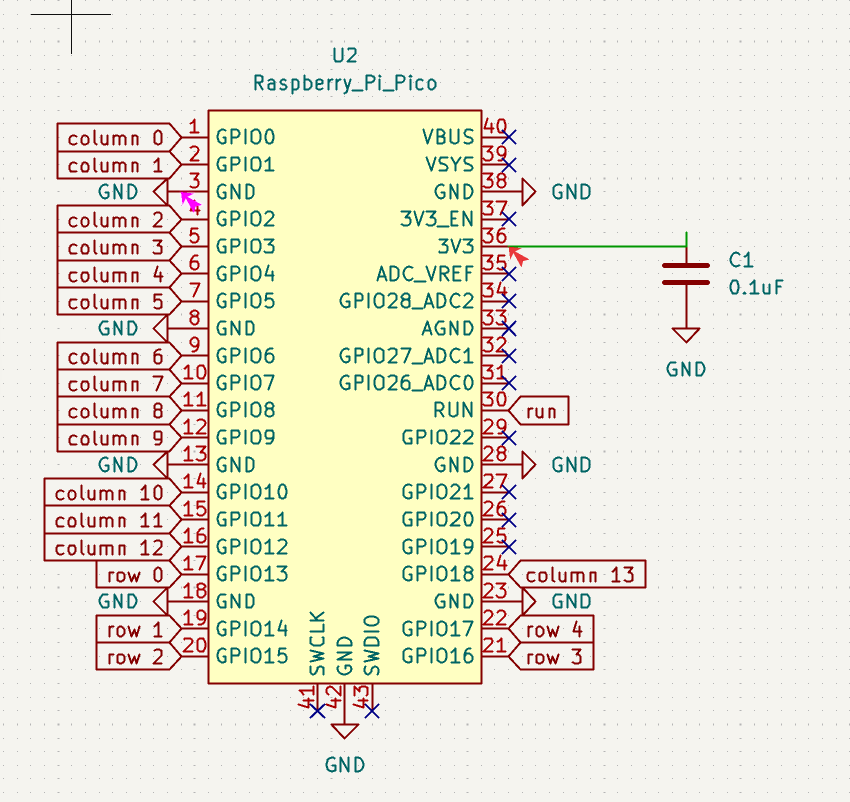

# My 60% Mechanical Keyboard with Raspberry Pi Pico

This is how I built my own mechanical keyboard from scratch using a Raspberry Pi Pico.

## The Build Story

### Step 1: I Made the PCB Layout

I started by designing a 60% keyboard matrix - 5 rows and 14 columns giving me 60 keys total in a standard ANSI layout. This meant figuring out exactly where each switch would go and how the electrical connections would work.

**The Layout I Designed:**
- 5 row lines
- 14 column lines  
- 60 key positions in standard ANSI format

**Matrix Grid:**
```
       Col0 Col1 Col2 Col3 Col4 Col5 Col6 Col7 Col8 Col9 Col10 Col11 Col12 Col13
Row0    Esc  1    2    3    4    5    6    7    8    9    0     -     =     Bksp
Row1    Tab  Q    W    E    R    T    Y    U    I    O    P     [     ]     \
Row2    Caps A    S    D    F    G    H    J    K    L    ;     '     None  Entr
Row3    Shft Z    X    C    V    B    N    M    ,    .    /     None  None  Shft
Row4    Ctrl Win  Alt  None None Space None None RAlt RGui None None None  Ctrl
```


### Step 2: I Routed the Electrical Design

Once I had the layout, I had to design the actual circuit. I added 1N4148 diodes on each switch to prevent ghosting (when multiple keys activate unintentionally). Then I routed the traces to connect everything properly.

**The Wiring:**
- Row pins (outputs): GP13, GP14, GP15, GP16, GP17
- Column pins (inputs): GP0, GP1, GP2, GP3, GP4, GP5, GP6, GP7, GP8, GP9, GP10, GP11, GP12, GP18
- Each switch connects through a 1N4148 diode cathode to column, anode to row

**How Each Switch Works:**
```
         Row Output (GP13-17)
              |
              |
         ┌────┴────┐
         │  Switch │
         └────┬────┘
              |
         ┌────▼────┐
         │ 1N4148  │ (Anode at switch, Cathode toward column)
         │ Diode   │
         └────┬────┘
              |
    Column Input (GP0-12, GP18) with 10kΩ pull-up to 3.3V
```

This diode arrangement:
- Prevents ghosting (multiple accidental key presses)
- Allows N-key rollover (multiple simultaneous key presses)
- Protects from electrical noise




### Step 3: I Designed the Case

I designed a case to hold everything together - the PCB, the Pico microcontroller, and all the switches. The case protects the electronics while keeping the keyboard solid and stable.


### Step 4: I Assembled the Keyboard

Soldered the diodes to each switch. Wired the rows and columns. Connected the Pico microcontroller. Put it all in the case and tested that everything worked.


### Step 5: I Configured the Firmware

I used QMK - an open-source keyboard firmware framework - to program the Pico. I set up:
- Layer 0: Standard QWERTY layout for typing
- Layer 1: Function keys, navigation, and media controls (F1-F12, arrow keys, volume control)

### Step 6: I Tested Everything

Plugged it in via USB and tested every single key to make sure the wiring was correct and nothing was ghosting.

## The Files I Created

Here's what makes this keyboard work:

- **config.h** - Tells QMK which GPIO pins are the rows and columns
- **keymaps/default/keymap.c** - Defines what keys do what (the QWERTY layout and function layer)
- **rules.mk** - Build configuration for the Pico
- **info.json** - Keyboard metadata for QMK tools

## Bill of Materials (BOM)

| Component | Purpose | Qty | Cost (USD) | Distributor | Link |
|-----------|---------|-----|-----------|-------------|------|
| Micro USB Cable | To connect the Pico | 1 | $1.62 | Amazon | [Buy](https://www.amazon.in/Ambrane-Unbreakable-Charging-Braided-Android/dp/B082LZGK39/) |
| 6mm Tactile Reset Button (SW1) | Reset button | 1 | $1.62 | Amazon | [Buy](https://www.amazon.in/ElectroBot-Momentary-Tactile-Push-Button/dp/B07PRRRBRY/) |
| 0.1uF Capacitor SMD 0805 (C1) | For the reset switch | 1 | $1.13 | Amazon | [Buy](https://www.amazon.in/0-1uF-100nF-Capacitor-0805-pack/dp/B0CMXNHQKP) |
| M2 Heat Set Inserts | For case assembly | 1 pack | $3.31 | Amazon | [Buy](https://www.amazon.in/BRASS-WAREHOUSE-Knurled-Threaded-Printing/dp/B0FMPZ3QHL/) |
| M2 Screws (20 pack) | Screwing the case | 1 pack | $1.93 | Amazon | [Buy](https://www.amazon.in/Tia-Golden-Screws-Length-Approx-480pcs/dp/B07VWKBHYZ/) |
| Keycaps | Keycaps for the keyboard | 1 set | $10.76 | Meckeys | [Buy](https://meckeys.com/shop/accessories/keyboard-accessories/keycaps/grey-black-keycaps/) |
| Gateron Switches | Switches for the keys | 7 packs | $15.12 | Meckeys | [Buy](https://meckeys.com/shop/accessories/keyboard-accessories/key-switches/gateron-optical-switch-pack/) |
| Raspberry Pi Pico | Microcontroller (the brain) | 1 | $4.00 | Robu.in | [Buy](https://robu.in/product/raspberry-pi-pico/) |
| 3D Printed Case | The keyboard case | 1 | $16.18 | Robu.in | — |
| 1N4148 Diode | Anti-ghosting diodes for the circuit | 1 pack | $3.08 | Amazon | [Buy](https://www.amazon.in/Circuit-Ranger-Switching-Electronic-Projects/dp/B0FJLP12GX) |
| PCB | The keyboard PCB | 5 | $36.01 | JLCPCB | — |
| **Total** | | | **$94.86** | | |

## How to Compile It

If you want to build the firmware yourself:

```bash
qmk compile -kb mechanical_keyboard -km default
```

This creates a .uf2 file that you can drag onto the Pico to program it.

## Key Mappings

**Layer 0 (QWERTY):**
```
Esc  1  2  3  4  5  6  7  8  9  0  -  =  Backspace
Tab  Q  W  E  R  T  Y  U  I  O  P  [  ]  \
Caps A  S  D  F  G  H  J  K  L  ;  '  Enter
Shift Z  X  C  V  B  N  M  ,  .  /  Shift
Ctrl Win Alt         Space      Alt Win Ctrl
```

**Layer 1 (Function):**
F-keys, navigation arrows, media controls (accessed by holding Fn)

## Troubleshooting

### Key Not Responding
- Check solder joint at the switch
- Verify diode is soldered correctly (stripe = cathode, toward column)
- Test continuity with multimeter between row and column through diode

### Key Registers Wrong Character
- Check the keymap in `keymap.c` - the wrong key might be programmed
- Verify the row/column position matches the physical layout
- Recompile and reflash firmware

### Multiple Keys Activating (Ghosting)
- Check if diode is missing or reversed
- Verify all diodes are installed on every switch
- Check for shorted traces or solder bridges

### Keyboard Not Detected by Computer
- Make sure Pico is in bootloader mode (press BOOTSEL while plugging in)
- Check USB cable is data cable, not charge-only
- Try a different USB port
- Make sure QMK compiled successfully (no build errors)


